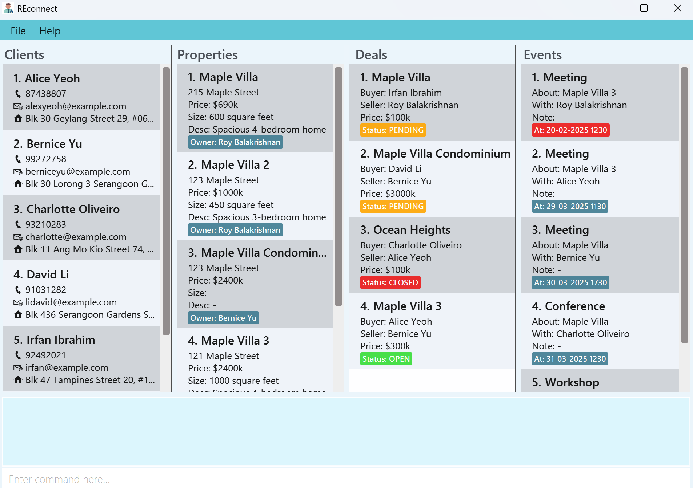
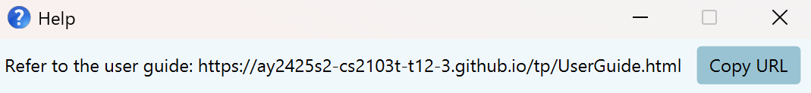

# REconnect User Guide

REconnect is a **desktop application for Real Estate agents to manage their work via a Command Line Interface** (CLI) while still having the benefits of a Graphical User Interface (GUI).

<box type="info" seamless>
    If you can type fast, REconnect can get your real estate management tasks done faster than traditional GUI apps.
</box>

<!-- * Table of Contents -->
<page-nav-print />

--------------------------------------------------------------------------------------------------------------------

## Quick start

1. Ensure you have Java `17` or above installed. 
    <box type="info" seamless>
        **Mac users:** Ensure you have the precise JDK version prescribed [here](https://se-education.org/guides/tutorials/javaInstallationMac.html).\
        If you need help installing Java, you may find [this guide](https://docs.oracle.com/en/java/javase/17/install/overview-jdk-installation.html) by Oracle useful. You can navigate the sidebar of the linked page to find platform-specific instructions.
    </box>

2. Download the latest `REconnect.jar` file from [here](https://github.com/AY2425S2-CS2103T-T12-3/tp/releases).

3. Copy the file to the folder you want to use as the _home folder_ for REconnect.

4. Open a command terminal:
   - **Windows**: Press `Win + R`, type `cmd`, and press Enter.
   - **Mac**: Press `Cmd + Space`, type `Terminal`, and press Enter.
   - **Linux**: Press `Ctrl + Alt + T` or search for "Terminal" in your Activities or Applications menu.

5. `cd` (change directory) into the folder you put the jar file in.
    <box type="tip" seamless>
        Type `cd␣` (with a space), and drag the folder into the terminal.
    </box>

6. Enter the command `java -jar REconnect.jar` to start the application. 
   A GUI similar to the below should appear in a few seconds. **Note:** The app contains some sample data, and it may not correspond to the data shown in the image below. 

   

7. Type the command in the command box and press Enter to execute it. e.g. typing **`help`** and pressing Enter will open the help window. 
   Some example commands you can try:

    * `add_client name/John Doe phone/98765432 email/johnd@example.com addr/311, Clementi Ave 2, #02-25` : Adds a client named `John Doe` to the client list panel.

    * `delete_property 3` : Deletes the 3rd property shown in the current property list.

    * `exit` : Exits the application.

8. Refer to the [Features](#features) below for details of each command.

--------------------------------------------------------------------------------------------------------------------

## Features

### UX Enhancement 1: Autocompletion for all commands

REconnect provides autocompletion for all commands. This allows users to quickly find the command they want to use 
without having to remember the exact syntax. It works by typing the first few letters of the command, choosing the 
command from the dropdown list, and pressing Enter to choose it. This works for command parameters as well. This
is especially useful for long commands with many parameters, as it saves time and reduces the chance of errors.

### UX Enhancement 2: Command history

REconnect keeps track of all the commands entered by the user during a session. To view this history, the cursor should
be in the 0th position of the command box. The user can then use the up and down arrow keys to scroll through the 
history of commands. At most 4 commands are shown at a time in the dropdown list to prevent cluttering the command box.
This allows users to quickly re-enter previous commands without having to type them out again.

<figure>
  
  <figcaption>Click the image to watch a demo</figcaption>
</figure>

**Note**:
The most recent command is shown at the top of the list, and the oldest command is shown at the bottom.\
Commands that caused an error are also included in the history and appear in red.\
The command history is cleared when the application is closed.

<box type="info" seamless>

**Notes about the command format:** 

* Words in `UPPER_CASE` are the parameters to be supplied by the user. 
  e.g. in `add_client name/NAME`, `NAME` is a parameter which can be used as `add_client name/John Doe`.

* Parameters can be in any order. 
  e.g. if the command specifies `name/NAME phone/PHONE_NUMBER`, `phone/PHONE_NUMBER name/NAME` is also acceptable.

* Extraneous parameters for commands that do not take in parameters (such as `help` and `exit`) will be ignored. 
  e.g. if the command specifies `help 123`, it will be interpreted as `help`.

* If you are using a PDF version of this document, be careful when copying and pasting commands that span multiple lines as space characters surrounding line-breaks may be omitted when copied over to the application.
</box>

### Viewing help : `help`

Shows a message explaining how to access the help page.

Format: `help`

---

## Client Commands

### Adding a client: `add_client`

Creates a new client in REconnect.

Format: `add_client name/NAME phone/PHONE_NUMBER [email/EMAIL] [addr/ADDRESS]`

* 💡 The client's email and address are optional fields.
* The client's name must not be empty and must not exceed 50 characters.
* The client's name must be a alphanumeric string and can contain spaces, and the special characters `/`, `\` and `'`. The name should not start with a special character.
* The client's phone number must start with either 6, 8 or 9, and must be exactly 8 digits long.
* Clients cannot have the same name or phone number, but they can share the same email address.
* Client names with different casings are allowed (i.e. "Bernice Yu" and "bernice yu" are distinct names).
* Duplicate names are not allowed.
* Multiple spaces in between names are accepted, similar to how you can do that in the contact list of your phone e.g. "John      Doe".

Examples:
* `add_client name/John Doe phone/98765432 email/johnd@example.com addr/John street, block 123, #01-01`
* `add_client name/John Doe phone/98765432`

### Editing a client : `edit_client`

Edits an existing client in REconnect.

Format: `edit_client INDEX [name/NAME] [phone/PHONE] [email/EMAIL] [addr/ADDRESS]`

* Edits the client at the specified `INDEX`. The index refers to the index number shown in the displayed client list, and should be a _positive integer_ not exceeding the client list size.
* At least one of the optional fields must be provided.
* The restrictions in the `add_client` command also apply here.
* Existing values will be updated to the input values.
* Editing a client's name will result in an update to his/her name if it exists in deals, listings, or events.

Examples:
* `edit_client 1 phone/91234567 email/johndoe@example.com` Edits the phone number and email address of the 1st client to be `91234567` and `johndoe@example.com` respectively.
* `edit_client 2 name/Betsy Crower` Edits the name of the 2nd client to be `Betsy Crower`

### Locating clients: `find_client`

Displays all clients that match the given criteria.

Format: `find_client [name_keywords/KEYWORDS] [addr/ADDRESS] [email/EMAIL] [phone/PHONE]`

* The order of the name keywords does not matter. e.g. `Hans Bo` will match `Bo Hans`.
* The following prefixes can be used:
  * `name_keywords/KEYWORDS` to search names by keywords (case-insensitive)
  * `addr/ADDRESS` to search by address (case-insensitive)
  * `email/EMAIL` to search by email (case-sensitive)
  * `phone/PHONE` to search by phone number
* For the name keywords, only full words will be matched e.g. `Han` will not match `Hans`.
* The rest of the keywords will be matched as substrings.
* Not all prefixes need to be used. You can use any combination of the above prefixes.
* All prefixes except for the first one must have a connective keyword prefix `AND_` or `OR_` (case-sensitive). The prefixes used must be of the same type: either all `AND_`, or all `OR_`.

Examples:
* `find_client name_keywords/John` returns `John` and `John Doe`
* `find_client name_keywords/Alice David` returns `Alice Yeoh`, `David Li`
* `find_client name_keywords/John AND_addr/123 Main St AND_email/example.com` returns clients with `John` being part of the name
and address containing `123 Main St` (case-insensitive) and email containing `example.com` 

### Listing all clients : `list_clients`

Displays all clients in REconnect.

Format: `list_clients`

* Any extra arguments given will throw an error.

<box type="tip" seamless>
    Meant to be used after a `find_client` command to show the full list of clients again.
</box>

### Deleting a client : `delete_client`

Deletes the specified client from REconnect.

Format: `delete_client INDEX`

* Deletes the client at the specified `INDEX`.
* The index refers to the index number shown in the displayed client list.
* The index **must be a positive integer** not exceeding the client list size.
* Extra parameters results in an error.
* **Note**: The client must not be involved in any existing deals, listings, or events. Else, the client cannot be deleted.
* Deleting a client is **not reversible**.

Examples:
* `list_clients` followed by `delete_client 2` deletes the 2nd client in REconnect.
* `find_client name_keywords/John` followed by `delete_client 1` deletes the 1st client in the results of the `find_client` command.

---

## Property Commands

### Adding a property : `add_property`

Creates a new property in REconnect.

Format: `add_property prop/PROPERTY_NAME owner/OWNER_ID addr/ADDRESS price/PRICE [size/SIZE] [desc/DESCRIPTION]`

* Adds a property with the specified details.
* The property name must be provided.
* The property name must not be empty and must not exceed 50 characters.
* The property name must be a alphanumeric string and can contain spaces, and the special characters `&` and `@`.
* **Note**: While the property name can contain the special characters `&` and `@`, they should not be at the start of the property name.
* Duplicate property names are not accepted (Case Sensitive i.e. "Maple Villa" and "maple villa" are distinct names).
* Multiple spaces in between names are accepted (i.e. "Maple Villa" and "Maple     Villa" are distinct property names that are valid).
* The owner ID refer to the index numbers shown in the displayed lists.
* The ID **must be positive integers** that do not exceed the client list size.
* The address must be provided.
* The price must be provided.
* PRICE must be a positive integer and is in thousands of S$ and must be between 3 and 6 digits.
* Both size and description are optional fields.
* SIZE must be a positive integer and is in square feet.
* SIZE should only contain integers from [100, 99999].
* Description if provided should be between 1 and 50 characters.

Examples:
* `add_property prop/Sunset Villa owner/1 addr/123 Sunset Way price/150 size/1200 desc/Beautiful sunset view`
* `add_property prop/Ocean Heights owner/2 addr/456 Marina Boulevard price/2800 size/1500`

### Editing a property : `edit_property`

Edits an existing property in REconnect.

Format: `edit_property INDEX [prop/PROPERTY_NAME] [owner/OWNER_ID] [addr/ADDRESS] [price/PRICE] [size/SIZE] [desc/DESCRIPTION]`

* Edits the property at the specified `INDEX`. The index refers to the index number shown in the displayed property list, and should be a _positive integer_ e.g. 1, 2, 3, ...
* At least one of the optional fields must be provided.
* Same restrictions as the add_property command.
* Existing values will be updated to the input values.

Examples:
* `edit_property 1 price/1600 desc/Newly renovated` Edits the price and description of the 1st property in the list
* `edit_property 2 prop/Sunrise Villa addr/789 Morning Street` Edits the name and address of the 2nd property in the list

### Finding properties : `find_property`

Displays all properties that match the specified criteria for name keywords, address, price, size, and/or owner.

Format: `find_property [name_keywords/KEYWORDS] [addr/ADDRESS] [price_</PRICE_BELOW] [price_>/PRICE_ABOVE] [size_</SIZE_BELOW] [size_>/SIZE_ABOVE] [owner/OWNER]`

* The order of the name keywords does not matter. e.g. `Maple Villa` will match `Villa Maple`.
* The following prefixes can be used:
    * `name_keywords/KEYWORDS` to search property names by keywords (case-insensitive)
    * `addr/ADDRESS` to search by address (case-insensitive)
    * `price_</PRICE_BELOW` to search by price below a certain value
    * `price_>/PRICE_ABOVE` to search by price above a certain value
    * `size_</SIZE_BELOW` to search by size below a certain value
    * `size_>/SIZE_ABOVE` to search by size above a certain value
    * `owner/OWNER` to search owner name by keywords (case-insensitive)
* For the name keywords, only full words will be matched e.g. `Han` will not match `Hans`.
* The address keyword will be matched as a substring.
* The PRICE and SIZE keywords used must follow the constraints defined in `add_property` command.
* Not all prefixes need to be used. You can use any combination of the above prefixes.
* The first prefix can be any of the above prefixes but must not be a connective one (the ones shown above).
* The rest of the prefixes must be preceded by a connective keyword `AND_` or `OR_` (case-sensitive).
* The connective keywords are used to combine multiple prefixes. All connective prefixes used must be of the same type:
  that is either all are preceded with `AND_` or all `OR_`.

Examples:
* `find_property owner/John Doe AND_price_>/500`
* `find_property addr/123 Main St OR_price_>/1000 OR_size_>/500`

### Listing all properties : `list_properties`

Displays all properties in REconnect.

Format: `list_properties`

* Meant to be used after a `find_property` command to show the full list of properties again.
* Any extra arguments given will throw an error.

### Deleting a property : `delete_property`

Deletes the specified property from REconnect.

Format: `delete_property INDEX`

* Deletes the property at the specified `INDEX`.
* The index refers to the index number shown in the displayed property list.
* The index **must be a positive integer** that does not exceed the property list size.
* Extra parameters results in an error.
* **Warning**: Deleting a property is not reversible.

Examples:
* `list_property` followed by `delete_property 2` deletes the 2nd property in REconnect
* `find_property name_keywords/Villa` followed by `delete_property 1` deletes the 1st property in the results of the `find_property` command

---

## Deal Commands

### Adding a deal : `add_deal`

Creates a new property deal in REconnect.

Format: `add_deal pid/PROPERTY_ID buyer/BUYER_ID price/PRICE [status/STATUS]`

* Creates a deal with the specified property, buyer and price details
* The property ID and buyer ID refer to the index numbers shown in the displayed lists
* The IDs **must be positive integers** that do not exceed the property and client list sizes respectively
* The property and buyer must exist in REconnect
* The property owner will automatically be set as the seller
* The property must not be involved in another existing deal
* The price must be a positive integer between 3 and 6 digits (in thousands)
* Status is optional and indicates the deal progress (OPEN, PENDING, CLOSED) (case-insensitive)
* If status is not specified, it defaults to PENDING

Examples:
* `add_deal pid/1 buyer/1 price/100 status/CLOSED` creates a `CLOSED` deal for property #1 with buyer #1 at $100,000
* `add_deal pid/3 buyer/2 price/500` creates a deal for property #3 with buyer #2 at $500,000 with default status of `PENDING`

### Updating a deal : `update_deal`

Updates an existing deal in REconnect.

Format: `update_deal INDEX [prop/PROPERTY_ID] [buyer/BUYER_ID] [price/PRICE] [status/STATUS]`

* Updates the deal with the specified `INDEX`
* At least one of the optional fields must be provided
* The INDEX refers to the index number shown in the displayed deal list, and should be a _positive integer_ that does not exceed the deal list size
* For property ID and buyer ID - the specified values must refer to existing entities in REconnect
* Price must be within valid range (3 to 6 digits in thousands)
* Status can be updated to indicate deal progress (OPEN, PENDING, CLOSED) (case-insensitive)
* Seller cannot be manually updated as it is automatically set based on the property owner

Examples:
* `update_deal 3 status/CLOSED` changes the status of deal #3 to CLOSED
* `update_deal 1 price/500 buyer/2` updates deal #1 with a new price of $500,000 and changes the buyer to client #2

### Finding deals : `find_deal`

Displays all deals that match the given criteria.

Format: `find_deal [prop/PROPERTY_NAME_KEYWORDS] [buyer/BUYER_NAME_KEYWORDS] [seller/SELLER_NAME_KEYWORDS] [status/STATUS] [price_</PRICE_BELOW] [price_>/PRICE_ABOVE]`

* The order of the name keywords does not matter. e.g. `Maple Villa` will match `Villa Maple`.
* The following prefixes can be used:
    * `prop/PROPERTY_NAME_KEYWORDS` to search property names by keywords (case-insensitive)
    * `buyer/BUYER_NAME_KEYWORDS` to search buyer names by keywords (case-insensitive)
    * `seller/SELLER_NAME_KEYWORDS` to search seller names by keywords (case-insensitive)
    * `status/STATUS` to search by deal status (case-insensitive)
    * `price_</PRICE_BELOW` to search by price below a certain value
    * `price_>/PRICE_ABOVE` to search by price above a certain value
* For the name keywords, only full words will be matched e.g. `Han` will not match `Hans`.
* The PRICE keyword used must follow the constraints defined in `add_deal` command.
* Not all prefixes need to be used. You can use any combination of the above prefixes.
* The first prefix can be any of the above prefixes but must not be a connective one (the ones shown above).
* The rest of the prefixes must be preceded by a connective keyword `AND_` or `OR_` (case-sensitive).
* The connective keywords are used to combine multiple prefixes. All connective prefixes used must be of the same type:
  that is either all are preceded with `AND_` or all `OR_`.

Examples:
* `find_deal prop/Villa` finds all deals involving properties with "Villa" in their names.
* `find_deal status/CLOSED` finds all closed deals.
* `find_deal buyer/John AND_seller/Mary` finds all deals with buyers containing "John" in their name AND sellers containing "Mary" in their name.
* `find_deal prop/Ocean OR_status/PENDING` finds all deals with properties containing "Ocean" in their name OR with PENDING status.

### Listing all deals : `list_deals`

Displays all deals in REconnect.

Format: `list_deals`

* Meant to be used after a `find_deal` command to show the full list of deals again.
* Any extra arguments given will throw an error.

**Note**: There is no `delete_deal` command as deals are not meant to be deleted. Instead, they can be updated to reflect the current status of the deal.

---

## Event Commands

### Adding an event : `add_event`

Creates a new event in REconnect.

Format: `add_event at/EVENT_START etype/EVENT_TYPE cid/CLIENT_ID pid/PROPERTY_ID note/EVENT_NOTE`

* Creates an event with the specified start date and time, event type, property, client, and note.
* Event start time must be in the format "DD-MM-YYYY HHmm".
* The date and time can be any valid one starting from `01-01-2025 0000`.
* This is to allow for past events that happened in the year before the app was created.
* Event type describes the nature of the event and must be one of the following: `conference`, `meeting`, `workshop` 
* or `others` (case-insensitive).
* The client ID refers to the index number shown in the displayed client list.
* The client ID **must be a positive integer** that does not exceed the client list size.
* The client must exist in REconnect.
* The property ID refers to the index number shown in the displayed property list.
* The property ID **must be a positive integer** that does not exceed the property list size.
* The property must exist in REconnect.
* Event note can contain additional details about the event and is **not** optional. It should contain
info on where the event will be held, and any other relevant information.
* There is no limit on the number of characters in the note.
* If there is nothing to add to the note, it should be set to "N/A".

Examples:
* `add_event at/30-04-2025 1700 etype/meeting cid/1 pid/1 note/Property viewing at 123 Main St`
* `add_event at/01-09-2026 1400 etype/others cid/3 pid/2 note/Thank client for successful deal`

### Editing an event : `edit_event`

Edits an existing event in REConnect

Format: `edit_event INDEX [at/EVENT_DATE_TIME] [etype/EVENT_TYPE] [cid/CLIENT_ID] [pid/PROPERTY_ID] [note/NOTE]`

* Edits the event at the specified `INDEX`.
* The index refers to the index number shown in the displayed event list, and should be a _positive integer_ that does not exceed the event list size.
* At least one of the optional fields must be provided.
* Existing values will be updated to the input values.
* The same list of constraints in `add_event` apply.
* If the start time is updated, the event list will be automatically re-sorted in the order they happen.

Examples:
* `edit_event 1 at/01-05-2025 1200 note/Changed to 12pm` Edits the start time and note of the 1st event in the list
* `edit_event 2 etype/meeting cid/3 pid/2` Edits the event type, client ID and property ID of the 2nd event in the list

### Finding events : `find_event`

Displays all events that match the given criteria.

Format: `find_event [before/TIMESTAMP] [after/TIMESTAMP] [etype/EVENT_TYPE] [with/CLIENT_NAME_KEYWORDS] [about/PROPERTY_NAME_KEYWORDS]`

* The order of the name keywords does not matter. e.g. `Maple Villa` will match `Villa Maple`.
* The following prefixes can be used:
    * `with/CLIENT_NAME_KEYWORDS` to search client names by keywords (case-insensitive)
    * `about/PROPERTY_NAME_KEYWORDS` to search property names by keywords (case-insensitive)
    * `etype/EVENT_TYPE` to search by event type (case-insensitive)
    * `before/TIMESTAMP` to search for events before a certain date and time
    * `after/TIMESTAMP` to search for events after a certain date and time
* For the name keywords, only full words will be matched e.g. `Han` will not match `Hans`.
* The TIMESTAMP keyword(s) used must follow the constraints defined in `add_event` command.
* Not all prefixes need to be used. You can use any combination of the above prefixes.
* The first prefix can be any of the above prefixes but must not be a connective one (the ones shown above).
* The rest of the prefixes must be preceded by a connective keyword `AND_` or `OR_` (case-sensitive).
* The connective keywords are used to combine multiple prefixes. All connective prefixes used must be of the same type:
  that is either all are preceded with `AND_` or all `OR_`.

Examples:
* `find_event with/Alice Yeo AND_etype/meeting` finds all meeting events with clients containing "Alice" or "Yeo" in their name.
* `find_event before/05-04-2025 1200 AND_after/01-03-2025 1000` finds all events between 01-03-2025 1000 and 05-04-2025 1200.

### Listing all events : `list_events`

Displays all events in REconnect.

Format: `list_events`

* Meant to be used after a `find_event` command to show the full list of events again.
* Any extra arguments given will throw an error.

### Deleting an event : `delete_event`

Deletes an event from REconnect.

Format: `delete_event INDEX`

* Deletes the event with the corresponding `INDEX`.
* The INDEX **must be a positive integer** that does not exceed the event list size.
* Extra parameters results in an error.
* **WARNING**: Deleting an event is not reversible.

Examples:
* `list_event` followed by `delete_event 2` deletes the 2nd event in REconnect
* `find_event etype/meeting` followed by `delete_event 1` deletes the 1st event in the filtered list

---

## Miscellaneous Commands

### Listing all clients, listings, deals and events : `list_all`

Displays all data in REconnect.

Format: `list_all`

* Displays all clients, properties, deals and events in REconnect.
* Meant to be used after any of the find commands to show the full list of data again.
* Any extra arguments given will throw an error.

### Exiting the program : `exit`

Exits the program.

Format: `exit`

---

### Saving the data

REconnect data are saved in the hard disk automatically after any command that changes the data. There is no need to save manually.

### Editing the data file

REconnect data are saved automatically as a JSON file `[JAR file location]/data/addressbook.json`. Users who know how JSON files work are welcome to update data directly by editing that data file.

<box type="warning" seamless>
    If your changes to the data file makes its format invalid, REConnect will discard all data and start with an empty data file at the next run.  Hence, it is recommended to take a backup of the file before editing it. 
    Furthermore, certain edits can cause the REConnect to behave in unexpected ways (e.g., if a value entered is outside the acceptable range). Therefore, edit the data file only if you are confident that you can update it correctly.
</box>

## FAQ

**Q**: How do I transfer my data to another Computer? 
**A**: Install the app in the other computer and overwrite the empty JSON file it creates with the JSON file that contains the data of your previous AddressBook home folder.

**Q**: What happens to existing deals if I update a property's owner? 
**A**: When you update a property's owner, any existing deals involving that property will automatically have their seller updated to reflect the new owner.

**Q**: Can I bulk update multiple deals at once? 
**A**: No, deals must be updated individually using the `update_deal` command with the specific index of each deal.

**Q**: How are deals sorted in the deals list? 
**A**: Deals are displayed in the order they were created, with the oldest deals appearing first.

**Q**: Do closed deals still appear in the main list? 
**A**: Yes, deals of all statuses (OPEN, PENDING, CLOSED) remain visible in the main list. Use the `find_deal` command to filter by status if needed.

**Q**: If I update a client's name, will it automatically update in all related deals? 
**A**: Yes, updating a client's name will automatically update their name in all deals where they appear as a buyer or seller.

**Q**: Can I convert the price to a different currency? 
**A**: No, REconnect currently only supports prices in Singapore dollars (S$). All prices are displayed and stored in thousands of S$.

**Q**: What's the difference between using `AND_` and `OR_` in deal searches? 
**A**: Using `AND_` means all conditions must be met (e.g., specific buyer AND specific status), while `OR_` means any condition can be met (e.g., specific buyer OR specific status).

--------------------------------------------------------------------------------------------------------------------

## Known issues

1. **When using multiple screens**, if you move the application to a secondary screen, and later switch to using only the primary screen, the GUI will open off-screen. The remedy is to delete the `preferences.json` file created by the application before running the application again.
2. **If you minimize the Help Window** and then run the `help` command (or use the `Help` menu, or the keyboard shortcut `F1`) again, the original Help Window will remain minimized, and no new Help Window will appear. The remedy is to manually restore the minimized Help Window.
3. **Emojis not being shown on Linux devices**: Emojis may not be displayed correctly on Linux devices. This is due to the default font used in JavaFX not supporting emojis.
4. **Overlapping property names or addresses**: Properties with different names but same addresses can be added, leading to potential overlaps. This will be fixed in a later release of the application.

--------------------------------------------------------------------------------------------------------------------

## Command summary

### Client Commands

| Action     | Format, Examples
-----------|----------------------------------------------------------------------------------------------------------------------------------------------------------------------
**Add Client**    | `add_client name/NAME phone/PHONE_NUMBER [email/EMAIL] [addr/ADDRESS]`   e.g., `add_client name/John Doe phone/98765432 email/johnd@example.com addr/John street, block 123, #01-01`
**Edit Client**   | `edit_client INDEX [name/NAME] [phone/PHONE] [email/EMAIL] [addr/ADDRESS]`  e.g.,`edit_client 1 phone/91234567 email/johndoe@example.com`
**Delete Client** | `delete_client INDEX`  e.g., `delete_client 3`
**Find Client**   | `find_client [name_keywords/KEYWORDS] [addr/ADDRESS] [email/EMAIL] [phone/PHONE]`  e.g., `find_client name_keywords/John AND_addr/123 Main St AND_email/example.com`
**List Clients**  | `list_clients`

### Property Commands

| Action     | Format, Examples
-----------|----------------------------------------------------------------------------------------------------------------------------------------------------------------------
**Add Property**  | `add_property prop/PROPERTY_NAME owner/OWNER_ID addr/ADDRESS price/PRICE [size/SIZE] [desc/DESCRIPTION]`   e.g., `add_property prop/Sunset Villa owner/1 addr/123 Sunset Way price/150 size/1200 desc/Beautiful sunset view`
**Edit Property** | `edit_property INDEX [prop/PROPERTY_NAME] [owner/OWNER_ID] [addr/ADDRESS] [price/PRICE] [size/SIZE] [desc/DESCRIPTION]`  e.g.,`edit_property 1 price/1600 desc/Newly renovated`
**Delete Property** | `delete_property INDEX`  e.g., `delete_property 1`
**Find Property** | `find_property [name_keywords/KEYWORDS] [addr/ADDRESS] [price_</PRICE_BELOW] [price_>/PRICE_ABOVE] [size_</SIZE_BELOW] [size_>/SIZE_ABOVE] [owner/OWNER]`  e.g., `find_property addr/123 Main St OR_price_>/1000 OR_size_>/500`
**List Properties** | `list_properties`

### Deal Commands

| Action     | Format, Examples
-----------|----------------------------------------------------------------------------------------------------------------------------------------------------------------------
**Add Deal**      | `add_deal pid/PROPERTY_ID buyer/BUYER_ID price/PRICE [status/STATUS]`   e.g., `add_deal pid/1 buyer/1 price/100 status/CLOSED`
**Update Deal**   | `update_deal INDEX [prop/PROPERTY_ID] [buyer/BUYER_ID] [price/PRICE] [status/STATUS]`  e.g., `update_deal 3 status/CLOSED`
**Find Deal**     | `find_deal [prop/PROPERTY_NAME_KEYWORDS] [buyer/BUYER_NAME_KEYWORDS] [seller/SELLER_NAME_KEYWORDS] [status/STATUS] [price_</PRICE_BELOW] [price_>/PRICE_ABOVE]`  e.g., `find_deal prop/Ocean OR_status/PENDING`
**List Deals**    | `list_deals`

### Event Commands

| Action     | Format, Examples
-----------|----------------------------------------------------------------------------------------------------------------------------------------------------------------------
**Add Event**     | `add_event at/EVENT_START etype/EVENT_TYPE cid/CLIENT_ID pid/PROPERTY_ID note/EVENT_NOTE`   e.g., `add_event etype/meeting pid/1 cid/2 at/30-03-2025 1730 note/N/A`
**Edit Event** | `edit_event INDEX [at/EVENT_DATE_TIME] [etype/EVENT_TYPE] [cid/CLIENT_ID] [pid/PROPERTY_ID] [note/NOTE]`   e.g., `edit_event 1 at/01-05-2025 1200 note/Changed to 12pm`
**Delete Event**  | `delete_event INDEX`  e.g., `delete_event 2`
**Find Event**    | `find_event [before/TIMESTAMP] [after/TIMESTAMP] [etype/EVENT_TYPE] [with/CLIENT_NAME_KEYWORDS] [about/PROPERTY_NAME_KEYWORDS]`  e.g., `find_event before/05-04-2025 1200 AND_after/01-03-2025 1000`
**List Events**   | `list_events`

### Miscellaneous Commands

| Action     | Format, Examples
-----------|----------------------------------------------------------------------------------------------------------------------------------------------------------------------
**List All** | `list_all`
**Help**          | `help`
**Exit**          | `exit`
