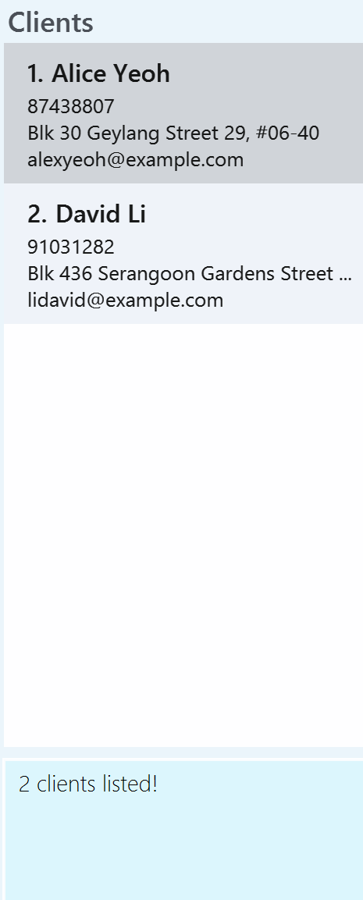

# REconnect User Guide

REconneect is a **desktop application for Real Estate agents to manage their work via a Command Line Interface** (CLI) while still having the benefits of a Graphical User Interface (GUI). If you can type fast, AB3 can get your contact management tasks done faster than traditional GUI apps.

<!-- * Table of Contents -->
<page-nav-print />

--------------------------------------------------------------------------------------------------------------------

## Quick start

1. Ensure you have Java `17` or above installed in your Computer. 
   **Mac users:** Ensure you have the precise JDK version prescribed [here](https://se-education.org/guides/tutorials/javaInstallationMac.html).

1. Download the latest `.jar` file from [here](https://github.com/AY2425S2-CS2103T-T12-3/tp/releases/download/MVP/REconnect.jar).

1. Copy the file to the folder you want to use as the _home folder_ for REconnect.

1. Open a command terminal, `cd` into the folder you put the jar file in, and use the `java -jar REconnect.jar` command to run the application. 
   A GUI similar to the below should appear in a few seconds. Note how the app contains some sample data. 
   

1. Type the command in the command box and press Enter to execute it. e.g. typing **`help`** and pressing Enter will open the help window. 
   Some example commands you can try:

    * `add_client name/John Doe phone/98765432 email/johnd@example.com addr/311, Clementi Ave 2, #02-25` : Adds a client named `John Doe` to the client list panel.

    * `delete_property 3` : Deletes the 3rd property shown in the current property list.

    * `exit` : Exits the app.

1. Refer to the [Features](#features) below for details of each command.

--------------------------------------------------------------------------------------------------------------------

## Features

<box type="info" seamless></box>

**Notes about the command format:** 

* Words in `UPPER_CASE` are the parameters to be supplied by the user. 
  e.g. in `add_client name/NAME`, `NAME` is a parameter which can be used as `add_client name/John Doe`.

* Parameters can be in any order. 
  e.g. if the command specifies `name/NAME phone/PHONE_NUMBER`, `phone/PHONE_NUMBER name/NAME` is also acceptable.

* Extraneous parameters for commands that do not take in parameters (such as `help`, `list`, `exit` and `clear`) will be ignored. 
  e.g. if the command specifies `help 123`, it will be interpreted as `help`.

* If you are using a PDF version of this document, be careful when copying and pasting commands that span multiple lines as space characters surrounding line-breaks may be omitted when copied over to the application.
  </box>

### Viewing help : `help`

Shows a message explaning how to access the help page.

Format: `help`

## Client Commands

### Adding a client: `add_client`

Adds a client to REconnect.

Format: `add_client name/NAME phone/PHONE_NUMBER [email/EMAIL] [addr/ADDRESS]`

* The client's name must be provided.
* The client's phone number must be provided.
* The client's email and address are optional fields.

Examples:
* `add_client name/John Doe phone/98765432 email/johnd@example.com addr/John street, block 123, #01-01`
* `add_client name/John Doe phone/98765432`

### Editing a client : `edit_client`

Edits an existing client in REconnect.

Format: `edit_client INDEX [name/NAME] [phone/PHONE] [email/EMAIL] [addr/ADDRESS]`

* Edits the client at the specified `INDEX`. The index refers to the index number shown in the displayed client list. The index **must be a positive integer** 1, 2, 3, ...
* At least one of the optional fields must be provided.
* Existing values will be updated to the input values.
* Editing a client's name will result in an update to his/her name if it exists in deals, listings, or events

Examples:
* `edit_client 1 phone/91234567 email/johndoe@example.com` Edits the phone number and email address of the 1st client to be `91234567` and `johndoe@example.com` respectively.
* `edit_client 2 name/Betsy Crower` Edits the name of the 2nd client to be `Betsy Crower`

### Listing all clients : `list_client`

Shows a list of all clients in REconnect.

format: `list_client`

### Locating clients by name: `find_client`

Finds clients whose names contain any of the given keywords.

Format: `find_client KEYWORD [MORE_KEYWORDS]`

* The search is case-insensitive. e.g `hans` will match `Hans`
* The order of the keywords does not matter. e.g. `Hans Bo` will match `Bo Hans`
* Only the name is searched.
* Only full words will be matched e.g. `Han` will not match `Hans`
* clients matching at least one keyword will be returned (i.e. `OR` search).
  e.g. `Hans Bo` will return `Hans Gruber`, `Bo Yang`

Examples:
* `find_client John` returns `John` and `John Doe`
* `find_client Alice David` returns `Alice Yeoh`, `David Li` 
  

### Deleting a client : `delete_client`

Deletes the specified client from REconnect.

Format: `delete_client INDEX`

* Deletes the client at the specified `INDEX`.
* The index refers to the index number shown in the displayed client list.
* The index **must be a positive integer** 1, 2, 3, …​

Examples:
* `list` followed by `delete 2` deletes the 2nd client in REconnect.
* `find_client Betsy` followed by `delete 1` deletes the 1st client in the results of the `find_client` command.

## Property Commands

### Adding a property : `add_property`

Adds a new property to REconnect.

Format: `add_property prop/PROPERTY_NAME addr/ADDRESS price/PRICE [size/SIZE] [desc/DESCRIPTION]`

* Adds a property with the specified details
* The property name must be provided
* The address must be provided
* The price must be provided
* PRICE must be a positive integer and is in thousands of S$
* Both size and description are optional fields
* SIZE must be a positive integer and is in square feet

Examples:
* `add_property prop/Sunset Villa addr/123 Sunset Way price/150 size/1200 desc/Beautiful sunset view`
* `add_property prop/Ocean Heights addr/456 Marina Boulevard price/2800 size/1500`

### Editing a property : `edit_property`

Edits an existing property in REconnect.

Format: `edit_property INDEX [prop/PROPERTY_NAME] [addr/ADDRESS] [price/PRICE] [size/SIZE] [desc/DESCRIPTION]`

* Edits the property at the specified `INDEX`. The index refers to the index number shown in the displayed property list.
* The index **must be a positive integer** that does not exceed the property list size
* At least one of the optional fields must be provided.
* Existing values will be updated to the input values.

Examples:
* `edit_property 1 price/1600000 desc/Newly renovated` Edits the price and description of the 1st property in the list
* `edit_property 2 prop/Sunrise Villa addr/789 Morning Street` Edits the name and address of the 2nd property in the list

### Listing all properties : `list_property`

Shows a list of all the properties in REconnect.

Format: `list_property`

### Finding properties : `find_property`

Finds properties whose names contain any of the given keywords.

Format: `find_property KEYWORD [MORE_KEYWORDS]`

* The search is case-insensitive. e.g `villa` will match `Villa`
* The order of the keywords does not matter
* Only the property name is searched
* Only full words will be matched e.g. `Sun` will not match `Sunset`
* Properties matching at least one keyword will be returned (i.e. `OR` search)

Examples:
* `find_property Villa` returns `Sunset Villa` and `Mountain Villa`
* `find_property Heights Towers` returns `Ocean Heights`, `City Towers`

### Deleting a property : `delete_property`

Deletes the specified property from REconnect.

Format: `delete_property INDEX`

* Deletes the property at the specified `INDEX`
* The index refers to the index number shown in the displayed property list
* The index **must be a positive integer** that does not exceed the property list size

Examples:
* `list_property` followed by `delete_property 2` deletes the 2nd property in REconnect
* `find_property Villa` followed by `delete_property 1` deletes the 1st property in the results of the `find_property` command

## Deal Commands

### Adding a deal : `add_deal`

Creates a new property deal in REconnect.

Format: `add_deal pid/PROPERTY_ID buyer/BUYER_ID price/PRICE [status/STATUS]`

* Creates a deal with the specified property, buyer and price details
* The property ID and buyer ID refer to the index numbers shown in the displayed lists
* The IDs **must be positive integers** 1, 2, 3, ...
* The property and buyer must exist in REconnect
* The property owner will automatically be set as the seller
* The property must not be involved in another existing deal
* The price must be less than 999.99 (in thousands)
* Status is optional and indicates the deal progress (PENDING, CLOSED, IN_NEGOTIATION)
* If status is not specified, it defaults to PENDING

Examples:
* `add_deal pid/1 buyer/1 price/100 status/CLOSED` creates a `CLOSED` deal for property #1 with buyer #1 at $100,000
* `add_deal pid/3 buyer/2 price/500` creates a deal for property #3 with buyer #2 at $500,000 with default status of `PENDING`

### Updating a deal : `update_deal`

Updates the details of an existing deal in REconnect.

Format: `update_deal dealId/DEAL_ID [prop/PROPERTY_NAME] [buyer/BUYER_ID] [seller/SELLER_ID] [price/PRICE] [status/STATUS]`

* Updates the deal with the specified `DEAL_ID`
* At least one of the optional fields must be provided
* The deal ID must be valid
* For property name, buyer ID, and seller ID - the specified values must refer to existing entities in REconnect
* Price must be within valid range (less than 999.99)
* Status can be updated to indicate deal progress

Examples:
* `update_deal dealId/3 status/CLOSED` changes the status of deal #3 to CLOSED
* `update_deal dealId/1 price/500 buyer/2` updates deal #1 with a new price of $500,000 and changes the buyer to client #2

### Listing all deals : `list_deal`

Shows a list of all deals in REconnect.

Format: `list_deal`

### Finding deals : `find_deal`

Shows a list of deals that match the given criteria.

Format: `find_deal [prop/PROPERTY_NAME] [buyer/BUYER_NAME] [seller/SELLER_NAME] [status/STATUS]`

* At least one search criterion must be provided
* The search for names is case-insensitive (e.g., "villa" will match "Villa")
* Partial name matches are supported (e.g., "John" will match "Johnny")
* For status, the match must be exact (PENDING, CLOSED, or IN_NEGOTIATION)
* If multiple criteria are provided, deals matching ANY of the criteria will be shown (OR logic)

Examples:
* `find_deal prop/Villa` finds all deals involving properties with "Villa" in their names
* `find_deal status/CLOSED` finds all closed deals
* `find_deal buyer/John seller/Mary` finds all deals with buyers containing "John" in their name OR sellers containing "Mary" in their name
* `find_deal prop/Ocean status/PENDING` finds all deals with properties containing "Ocean" in their name OR with PENDING status

## Event Commands

### Adding an event : `add_event`

Creates a new event in REconnect.

Format: `add_event pid/PROPERTY_ID cid/CLIENT_ID etype/EVENT_TYPE at/EVENT_START [note/EVENT_NOTE]`

* Creates an event with the specified property, client, event type, start time and optional note
* The property ID refers to the index number shown in the displayed property list
* The property ID **must be a positive integer** 1, 2, 3, ...
* The property must exist in REconnect
* The client ID refers to the index number shown in the displayed client list
* The client ID **must be a positive integer** 1, 2, 3, ...
* The client must exist in REconnect
* Event type describes the nature of the event (e.g., "viewing", "meeting")
* Event start time must be in the format "YYYY-MM-DD HH:mm"
* Event note is optional and can contain additional details

Examples:
* `add_event pid/1 cid/1 etype/viewing at/2024-01-15 14:30 note/Property viewing at 123 Main St`
* `add_event pid/3 cid/2 etype/meeting at/2024-01-20 10:00`

### Editing an event : `edit_event`

Edits an existing event in REConnect

Format: `edit_event INDEX [etype/EVENT_TYPE] [pid/PROPERTY_ID] [cid/CLIENT_ID] [at/EVENT_DATE_TIME] [note/NOTE]`

* Edits the client at the specified `INDEX`. The index refers to the index number shown in the displayed client list. The index **must be a positive integer** 1, 2, 3, ...
* At least one of the optional fields must be provided.
* Existing values will be updated to the input values.
* If the start time is updated, the event list will be automatically re-sorted in the order they happen

### Listing all events : `list_event`

Shows a list of all events in REconnect.

Format: `list_event`

### Finding events : `find_event`

Shows a list of events that match the given criteria.

Format: `find_event [cid/CLIENT_ID] [etype/EVENT_TYPE]`

* At least one search criteria must be provided
* The search is case-insensitive
* Partial matches are allowed for event type

Examples:
* `find_event etype/viewing` finds all viewing events
* `find_event cid/1` finds all events for client #1

### Deleting an event : `delete_event`

Deletes an event from REconnect.

Format: `delete_event EVENT_ID`

* Deletes the event with the specified `EVENT_ID`
* The event ID must be valid

Examples:
* `list_event` followed by `delete_event 2` deletes the 2nd event in REconnect
* `find_event etype/viewing` followed by `delete_event 1` deletes the 1st event in the filtered list

### Listing all clients, listings, deals and events : `list_all`

Shows a list of all everything in REConnect

Format: `list_all`

### Exiting the program : `exit`

Exits the program.

Format: `exit`

### Saving the data

REconnect data are saved in the hard disk automatically after any command that changes the data. There is no need to save manually.

### Editing the data file

REconnect data are saved automatically as a JSON file `[JAR file location]/data/addressbook.json`. Users who know how JSON files work are welcome to update data directly by editing that data file.

<box type="warning" seamless></box>

**Caution:**
If your changes to the data file makes its format invalid, AddressBook will discard all data and start with an empty data file at the next run.  Hence, it is recommended to take a backup of the file before editing it. 
Furthermore, certain edits can cause the AddressBook to behave in unexpected ways (e.g., if a value entered is outside the acceptable range). Therefore, edit the data file only if you are confident that you can update it correctly.
</box>

## FAQ

**Q**: How do I transfer my data to another Computer? 
**A**: Install the app in the other computer and overwrite the empty JSON file it creates with the JSON file that contains the data of your previous AddressBook home folder.

--------------------------------------------------------------------------------------------------------------------

## Known issues

1. **When using multiple screens**, if you move the application to a secondary screen, and later switch to using only the primary screen, the GUI will open off-screen. The remedy is to delete the `preferences.json` file created by the application before running the application again.
2. **If you minimize the Help Window** and then run the `help` command (or use the `Help` menu, or the keyboard shortcut `F1`) again, the original Help Window will remain minimized, and no new Help Window will appear. The remedy is to manually restore the minimized Help Window.

--------------------------------------------------------------------------------------------------------------------

## Command summary

Action     | Format, Examples
-----------|----------------------------------------------------------------------------------------------------------------------------------------------------------------------
**Add Client**    | `add_client name/NAME phone/PHONE_NUMBER [email/EMAIL] [addr/ADDRESS]`   e.g., `add_client name/James Ho phone/22224444 email/jamesho@example.com addr/123, Clementi Rd, 1234665`
**Add Deal**      | `add_deal pid/PROPERTY_ID buyer/BUYER_ID price/PRICE [status/STATUS]`   e.g., `add_deal pid/1 buyer/1 price/100 status/CLOSED`
**Add Event**     | `add_event etype/EVENT_TYPE pid/PROPERTY_ID cid/CLIENT_ID at/EVENT_DATE_TIME [note/NOTE]`   e.g., `add_event etype/meeting pid/1 cid/2 at/30-03-2025 1730 note/N/A`
**Add Property**  | `add_property prop/PROPERTY_NAME price/PRICE [size/SIZE] [desc/DESCRIPTION]`   e.g., `add_property prop/Sunset Villa price/1000000 size/1200 desc/Beautiful sunset view`
**Delete Client** | `delete_client INDEX`  e.g., `delete_client 3`
**Delete Event**  | `delete_event EVENT_ID`  e.g., `delete_event 2`
**Delete Property** | `delete_property INDEX`  e.g., `delete_property 1`
**Edit Client**   | `edit_client INDEX [name/NAME] [phone/PHONE_NUMBER] [email/EMAIL] [addr/ADDRESS]`  e.g.,`edit_client 2 name/James Lee email/jameslee@example.com`
**Edit Property** | `edit_property INDEX [prop/PROPERTY_NAME] [price/PRICE] [size/SIZE] [desc/DESCRIPTION]`  e.g.,`edit_property 1 price/1200000 desc/Newly renovated`
**Edit Event** | `edit_event INDEX [etype/EVENT_TYPE] [pid/PROPERTY_ID] [cid/CLIENT_ID] [at/EVENT_DATE_TIME] [note/NOTE]`
**Find Client**   | `find_client KEYWORD [MORE_KEYWORDS]`  e.g., `find_client James Jake`
**Find Deal**     | `find_deal [prop/PROPERTY_NAME] [buyer/BUYER_NAME] [seller/SELLER_NAME] [status/STATUS]`  e.g., `find_deal prop/Villa status/PENDING`
**Find Event**    | `find_event etype/EVENT_TYPE`  e.g., `find_event etype/viewing`
**Find Property** | `find_property KEYWORD [MORE_KEYWORDS]`  e.g., `find_property Villa Condo`
**List Clients**  | `list_client`
**List Deals**    | `list_deal`
**List Events**   | `list_event`
**List Properties** | `list_property`
**List All** | `list_all`
**Update Deal**   | `update_deal dealId/DEAL_ID [prop/PROPERTY_NAME] [buyer/BUYER_ID] [seller/SELLER_ID] [price/PRICE] [status/STATUS]`  e.g., `update_deal dealId/3 status/CLOSED`
**Help**          | `help`
**Exit**          | `exit`
